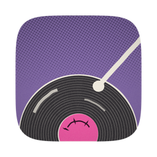
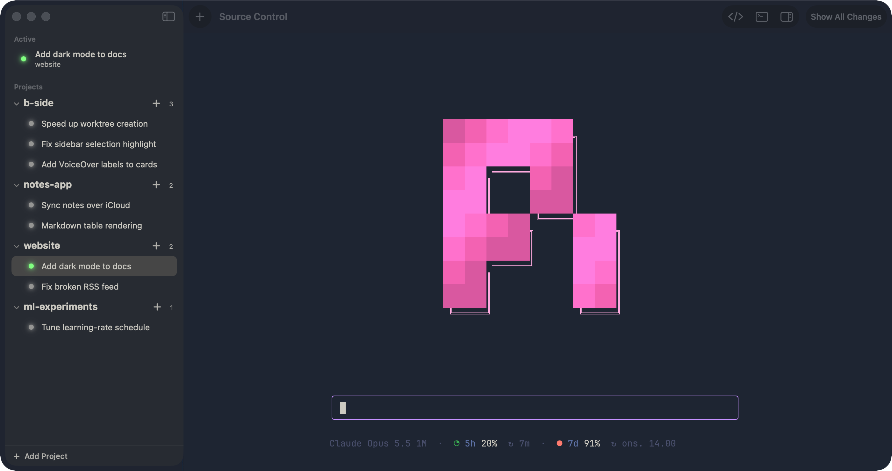
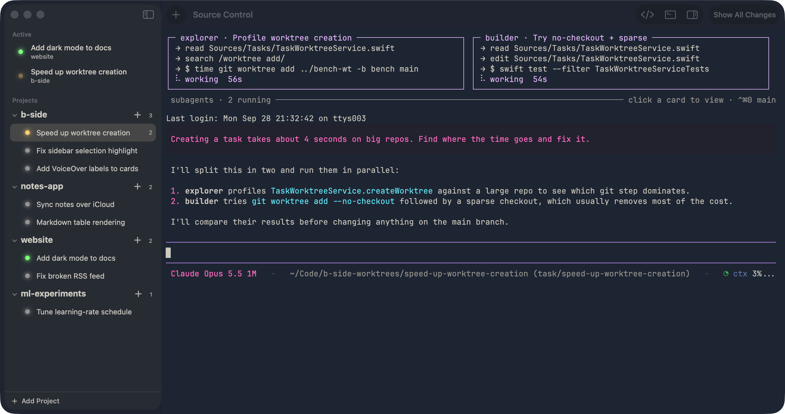

<p align="center"></p>

# B-Side

A native macOS app for running several [Pi](https://github.com/earendil-works/pi)
coding agents side by side without them stepping on each other.

Every task gets its own git branch and worktree, and its own Pi session in a
real terminal (libghostty). Switch between tasks from the sidebar and each one
picks up where you left it: the terminal keeps running in the background, and
reopening the app resumes the same Pi session instead of starting over.



## What it does

- **Projects and tasks.** Add a git repository as a project; each new task
  branches from it into a separate worktree, so parallel agents never share a
  working copy.
- **Pi in a real terminal.** Sessions run in embedded Ghostty terminals and
  follow your Ghostty theme and font, or a theme you pick in Settings.
- **Subagents at a glance.** When a session starts subagents, they appear as
  live cards above its terminal, showing what each one is doing; click a card to
  watch that agent's own terminal.
- **Source control built in.** A sidebar shows the task's changes, with
  staging, commit and push, and a full diff view.
- **Notifications.** A sound and a macOS notification when Pi finishes or needs
  an answer, so you can leave it running in the background.



## Task titles

B-Side renames a task from its first Pi prompt. Pick how in Settings → Titles:

- **First words of the prompt.** A heuristic; nothing leaves the Mac.
- **Local Model** (default). Runs a GGUF model with llama.cpp's
  `llama-completion` (`brew install llama.cpp`). The default is the
  Hugging Face repo `Mabeck/qwen3.5-0.8b-kth8-titles`, downloaded from the tab.
- **Claude CLI.** One-shot `claude -p` with no tools and no saved session.
- **Codex CLI.** One-shot `codex exec` in a read-only sandbox.
- **OpenAI-Compatible API.** Any `/chat/completions` endpoint: Ollama, LM
  Studio, llama-server, vLLM, OpenRouter, OpenAI. For Ollama, set the base URL
  to `http://localhost:11434/v1` and the model to e.g. `qwen3:4b`. An optional
  API key is kept in the Keychain.

The prompt template is editable; `{prompt}` is replaced by the first prompt.
If a backend fails or returns something that isn't a title, B-Side falls back
to the first-words heuristic. The tab has a Test button that shows the exact
input sent and the time taken.

## Requirements

macOS 26 on Apple Silicon only — the libghostty XCFramework is arm64.

Building requires Xcode (not just the Command Line Tools) — the Command Line
Tools toolchain ships without the Swift Testing frameworks, so `swift test`
cannot link against it. Check the right one is selected with `xcode-select -p`;
it should print a path inside `Xcode.app`.

## Build

```sh
swift build
```

## Test

```sh
swift test
```

Filter to one suite with `swift test --filter GitCLITests`.

## Run

```sh
./scripts/bundle.sh
open "dist/B-Side.app"
```

Run it from the app bundle rather than `swift run`: the SwiftUI `Settings` scene
and user notifications need a real bundle identifier.

## Release

Pushing a `vX.Y.Z` tag runs `.github/workflows/release.yml`: tests, bundle,
launch smoke test, then a GitHub Release with a zipped `.app` and its SHA-256.
Tags with a suffix (`v0.2.0-beta.1`) are marked pre-release.

```sh
git tag v0.2.0 && git push origin v0.2.0
```

The app is ad-hoc signed and not notarized, so a downloaded copy is quarantined
by Gatekeeper. Clear it after unzipping:

```sh
xattr -dr com.apple.quarantine B-Side.app
```
